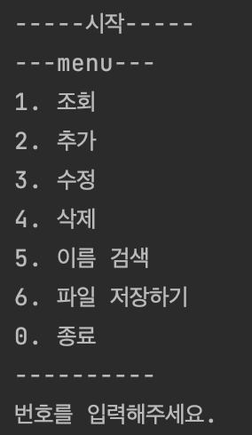
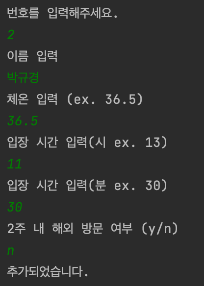
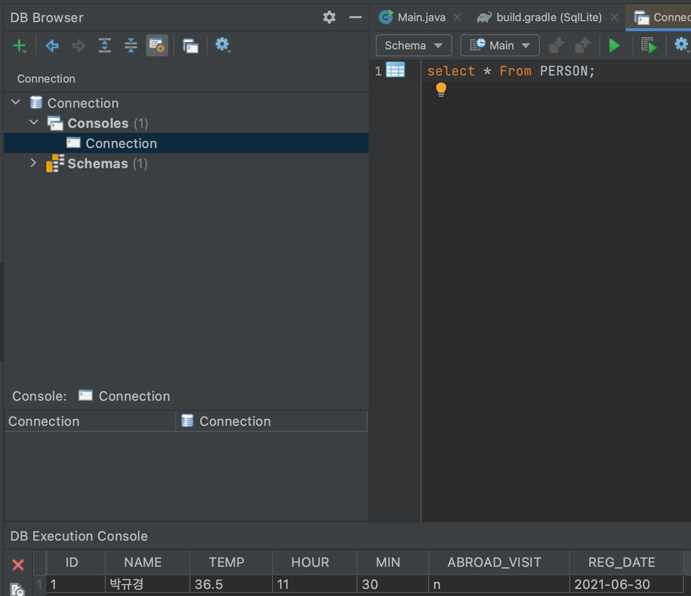

# SqlLite를 활용한 CRUD

### 개발 순서
1. 새 프로젝트 생성 (File > New > Project.. > Gradle > Java) 후 PassList 복사
2. https://mvnrepository.com 에서 sqlite-jdbc 검색 후 버전 고르고 gradle 복사 --> build.gradle 파일에서 dependencies에 추가
  
   
3. ArrayList에 조회, 추가, 수정, 삭제 하는 부분을 DDLService, DMLSerive, DQLService에서 PreparedStatement 객체 생성 후 쿼리를 통해 조회, 추가, 수정, 삭제 대체
참고 링크 ( PrepareStatement 사용 방법)
    https://sas-study.tistory.com/160

### 결과
1.menu에서 번호선택 

2.데이터 추가 

3.결과 

### SQL 쿼리

* 테이블명 : PERSON
* 컬럼이름(타입) : ID(INTEGER),NAME(TEXT),HOUR(INTEGER),MIN(INTEGER),ABROAD_VISIT(TEXT), REG_DATE(TEXT)
* 컬럼 소개
    * ID : 인덱스
    * NAME : 방문한 사람 이름
    * HOUR : 방문한 시간 (시)
    * MIN : 방문한 시간 (분)
    * ABROAD_VISIT : 2주 내 해외 방문 여부 (y/n)
    * REG_DATE : 등록 일자

